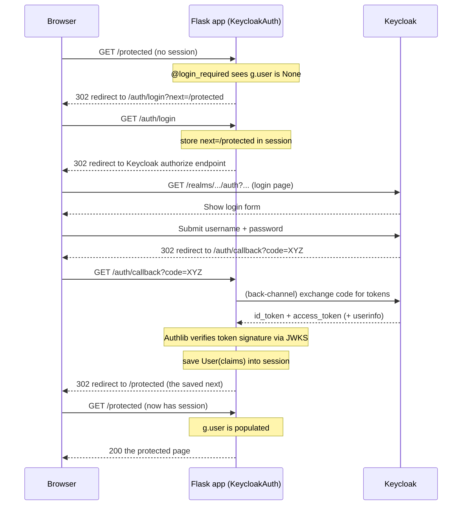
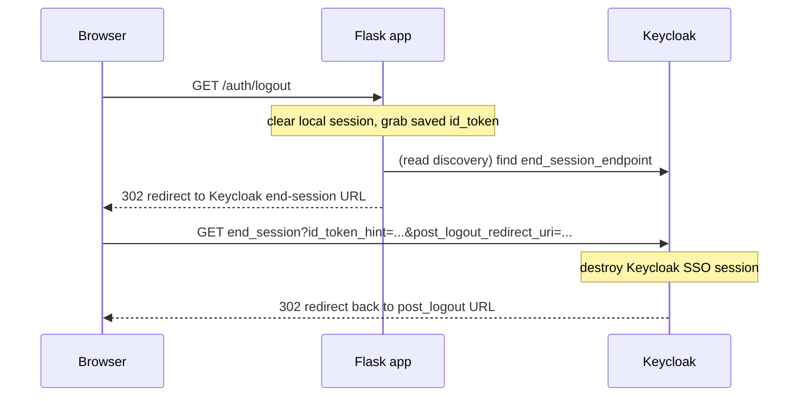

# How Authentication Works

This document explains what actually happens when a user logs into an app that
uses `keycloak-flask-auth`. It uses the **OpenID Connect (OIDC) Authorization
Code Flow**, with Keycloak acting as the Identity Provider (IdP) and your Flask
app as the client.

If you just want the short version: your app never sees the user's password.
Keycloak handles the login, then hands your app a signed token describing who
the user is. That token is turned into a `User` object and stored in the Flask
session.

---

## The players

| Piece | Role |
| --- | --- |
| **Browser** | The end user. |
| **Flask app** | Your app (the OIDC *client*). |
| **`KeycloakAuth`** | The extension that wires everything together. |
| **Keycloak** | The Identity Provider that authenticates users and issues tokens. |
| **Authlib** | The underlying OAuth/OIDC library that does token exchange + signature verification. |

Three routes are registered automatically under `url_prefix` (default `/auth`):

- `GET /auth/login` — starts the login flow
- `GET /auth/callback` — Keycloak redirects back here with a code
- `GET /auth/logout` — clears the session and logs out of Keycloak

These live in [src/keycloak_flask_auth/routes.py](../src/keycloak_flask_auth/routes.py).

---

## One-time setup (`init_app`)

When you call `KeycloakAuth(app)`, [`init_app`](../src/keycloak_flask_auth/auth.py#L74) does the wiring:

1. **Resolves config** from constructor args or environment variables
   (`KEYCLOAK_SERVER_URL`, `KEYCLOAK_REALM`, `KEYCLOAK_CLIENT_ID`,
   `KEYCLOAK_CLIENT_SECRET`, …).
2. **Registers an Authlib OAuth client** pointed at Keycloak's discovery
   document: `{server_url}/realms/{realm}/.well-known/openid-configuration`.
   That URL tells Authlib where all the OIDC endpoints and signing keys are.
3. **Adds a `before_request` hook** (`_load_user`) so that on *every* request,
   `g.user` is populated from the session.
4. **Adds a template context processor** so `current_user` and
   `is_authenticated` are available in Jinja templates.
5. **Registers the `/login`, `/callback`, `/logout` blueprint.**

---

## The login flow (step by step)

### 1. A user hits a protected route

Routes decorated with [`@login_required`](../src/keycloak_flask_auth/decorators.py#L10)
or [`@roles_required(...)`](../src/keycloak_flask_auth/decorators.py#L33) check
`g.user`. If it's `None`, the decorator redirects to `/auth/login`, passing the
original URL as `?next=...` so the user can be returned there afterwards.

### 2. `/auth/login` kicks off OIDC

The [`login`](../src/keycloak_flask_auth/routes.py#L20) view:

- Saves the `next` URL in the session (`_kfa_next`).
- Calls `auth.client.authorize_redirect(redirect_uri)`, which sends the browser
  to Keycloak's authorization endpoint. Authlib also stores a CSRF `state` value
  in the session to protect the round-trip.

### 3. Keycloak authenticates the user

The user logs in on **Keycloak's** page (password, MFA, social login — whatever
the realm is configured for). Your app never handles credentials. On success,
Keycloak redirects the browser back to `/auth/callback` with a short-lived
**authorization code**.

### 4. `/auth/callback` exchanges the code for tokens

The [`callback`](../src/keycloak_flask_auth/routes.py#L27) view:

- Calls `auth.client.authorize_access_token()`. This is a **back-channel**
  (server-to-server) request: Authlib sends the code + client secret to
  Keycloak and receives the `id_token` and `access_token`. Authlib verifies the
  ID token's signature against Keycloak's public keys (JWKS) and validates the
  `state`.
- Pulls the user **claims** out of `token["userinfo"]` (falling back to the
  UserInfo endpoint if needed).
- Calls [`auth.save_user(claims, id_token)`](../src/keycloak_flask_auth/auth.py#L142),
  which builds a `User` and stores the claims in the session (`_kfa_user`), plus
  the raw `id_token` (`_kfa_id_token`) for logout.
- Redirects the browser to the saved `next` URL.

### 5. Subsequent requests

On every request, [`_load_user`](../src/keycloak_flask_auth/auth.py#L135) runs
before the view and rebuilds `g.user` from the session claims. No network call
to Keycloak is needed — the session cookie is the source of truth until logout
or session expiry.

---

## What is a `User`?

[`User`](../src/keycloak_flask_auth/user.py#L8) is a thin wrapper over the OIDC
claims dict. It exposes convenient fields and role helpers:

- Profile: `user.sub`, `user.username`, `user.email`, `user.name`, …
- Roles:
  - `user.realm_roles` — from `realm_access.roles`
  - `user.client_roles` — from `resource_access.<client_id>.roles`
  - `user.roles` — both combined and de-duplicated
  - `user.has_role("admin")` — must have **all** listed roles
  - `user.has_any_role("a", "b")` — must have **at least one**

The raw claims are always available via `user.claims`.

---

## Role-based access

[`@roles_required("admin")`](../src/keycloak_flask_auth/decorators.py#L33)
first ensures the user is logged in (redirecting to login if not), then checks
roles:

- `require_all=True` (default): user must have **every** listed role.
- `require_all=False`: user needs **any** of them.

If authenticated but lacking the roles, the request gets **HTTP 403**.

---

## The logout flow

The [`logout`](../src/keycloak_flask_auth/routes.py#L41) view:

1. Clears the local Flask session via
   [`clear_session`](../src/keycloak_flask_auth/auth.py#L149) and retrieves the
   stored `id_token`.
2. Looks up Keycloak's `end_session_endpoint` from the discovery document.
3. Redirects the browser there with `id_token_hint`, `client_id`, and
   `post_logout_redirect_uri`. This performs **single sign-out** — the user is
   logged out of Keycloak itself, not just this one app.

If the end-session endpoint can't be reached, it just redirects to the
post-logout URL (or back to login).

---

## Where things are stored

| Session key | Contents | Set by | Cleared by |
| --- | --- | --- | --- |
| `_kfa_user` | The user's OIDC claims | `save_user` | `clear_session` |
| `_kfa_id_token` | Raw ID token (for logout hint) | `save_user` | `clear_session` |
| `_kfa_next` | Where to return after login | `/auth/login` | `/auth/callback` |

All of this lives in Flask's signed session cookie, so remember to set
`app.secret_key`.

---

## Quick mental model

1. **Not logged in?** Decorator → `/auth/login` → Keycloak login page.
2. **Logged in at Keycloak?** Keycloak → `/auth/callback` → tokens verified →
   `User` saved in session → back to where you started.
3. **Every request?** `g.user` is rebuilt from the session cookie.
4. **Logout?** Clear session + tell Keycloak to end the SSO session.
